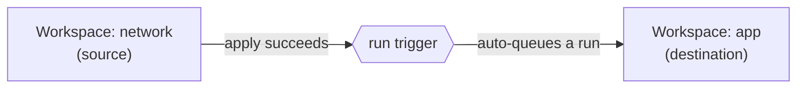

# Run Triggers

> **Pitch (1 line):** chain workspaces — when a **source** workspace finishes a **successful apply**, HCP automatically **queues a run** in this (destination) workspace.

## 🎯 What the exam tests

- **What a run trigger is for:** automate workspace→workspace ordering for **cross-workspace dependencies** (e.g. network applies → app workspace runs).
- **Direction:** configured on the **destination** workspace, pointing at one or more **source** workspaces ("run *after* these apply").
- The **trigger event** is a **successful apply** in the source — a plan-only/speculative run does **not** fire it.
- What it is **not**: not VCS integration, not credential injection, not an approval gate.

## 🧠 Core (non-obvious bits)

- A source workspace's **applied** run **queues** a run in the destination; the destination still follows its own workflow (auto-apply setting decides whether it applies or waits for approval).
- Typical pairing: destination reads the source's outputs via **`terraform_remote_state`** — the trigger just makes it re-run when the upstream changes.
- Set on the **destination** ("this workspace has N source workspaces"), up to **20** sources per workspace.
- One-directional and event-based — it only reacts to the source's apply, it doesn't share state or variables.

## ⚠️ Common traps

- Run trigger ≠ **VCS-driven** run: "always run from the newest commit of a branch" is **VCS integration**, not a run trigger.
- Run trigger ≠ **dynamic credentials** (temporary cloud auth) and ≠ **apply approval / Sentinel** (human/policy gate). Those are separate features.
- A **plan-only** or failed run in the source does **not** trigger the destination — only a **successful apply** does.

## 🖼️ Diagram

## 🔄 Easily confused with

- Workflow (**how a run is triggered**: CLI / VCS / API) vs run trigger (**one workspace's apply triggers another**) → [HCP workspaces](./03-hcp-workspaces.md)

---

